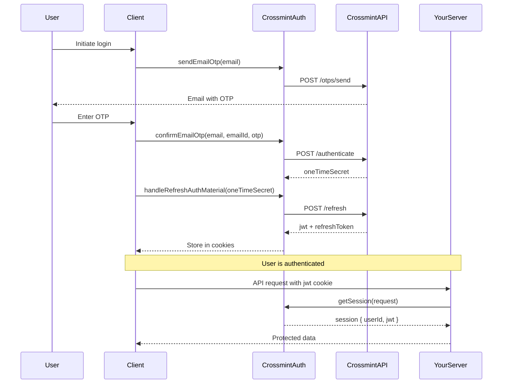

# Authentication

Crossmint SDK provides two authentication clients optimized for different environments: **client-side** and **server-side**. Both use JWT-based sessions with refresh tokens for secure, persistent authentication.

## Client-Side Authentication

The `CrossmintAuthClient` is designed for browser and client-side environments, handling authentication flows with automatic token management.

### Initialization

```typescript
import { CrossmintAuth } from "@crossmint/client-sdk-auth";
import { createCrossmint } from "@crossmint/common-sdk-base";

const crossmint = createCrossmint({
  apiKey: "your-client-api-key"
});

const auth = CrossmintAuth.from(crossmint, {
  callbacks: {
    onTokenRefresh: (authMaterial) => {
      console.log("Token refreshed", authMaterial);
    },
    onLogout: () => {
      console.log("User logged out");
    }
  },
  logoutRoute: "/api/auth/logout" // Optional custom logout endpoint
});
```

### Authentication Methods

The client supports multiple authentication flows:

#### Email OTP

```typescript
// Send OTP to email
const { emailId } = await auth.sendEmailOtp("user@example.com");

// Verify OTP
const oneTimeSecret = await auth.confirmEmailOtp(
  "user@example.com",
  emailId,
  "123456"
);

// Exchange for session
await auth.handleRefreshAuthMaterial(oneTimeSecret);
```

#### OAuth Providers

```typescript
// Get OAuth URL
const oauthUrl = await auth.getOAuthUrl("google");

// Redirect user to oauthUrl
window.location.href = oauthUrl;

// After redirect, exchange code for session
const params = new URLSearchParams(window.location.search);
const oneTimeSecret = params.get("ots");
await auth.handleRefreshAuthMaterial(oneTimeSecret);
```

<Note>
OAuth providers include: `google`, `twitter`, `discord`, `facebook`, and more. Ensure the provider is enabled in your Crossmint Console.
</Note>

#### Smart Wallet Authentication

```typescript
// Request signature challenge
const { message } = await auth.signInWithSmartWallet(
  walletAddress,
  "evm" // or "solana"
);

// Sign message with wallet
const signature = await wallet.signMessage(message);

// Authenticate
const { oneTimeSecret } = await auth.authenticateSmartWallet(
  walletAddress,
  "evm",
  signature
);

await auth.handleRefreshAuthMaterial(oneTimeSecret);
```

#### Farcaster

```typescript
import { useSignIn } from "@farcaster/auth-kit";

const farcasterData = useSignIn();
const oneTimeSecret = await auth.signInWithFarcaster(farcasterData);

await auth.handleRefreshAuthMaterial(oneTimeSecret);
```

### Session Management

<Info>
The client automatically refreshes JWT tokens before expiration and stores them in browser cookies/localStorage.
</Info>

```typescript
// Get current user
const user = await auth.getUser();
console.log(user.id, user.email);

// Logout
await auth.logout();
```

### Token Storage

By default, authentication material is stored in cookies:
- `jwt` - Session token (expires after 1 hour)
- `refreshToken` - Long-lived refresh token (expires after 30 days)

You can customize storage with a custom `StorageProvider`:

```typescript
const auth = CrossmintAuth.from(crossmint, {
  storageProvider: {
    get: async (key) => { /* custom get */ },
    set: async (key, value, expiresAt) => { /* custom set */ },
    remove: async (key) => { /* custom remove */ }
  }
});
```

## Server-Side Authentication

The `CrossmintAuthServer` is designed for Node.js server environments, providing session validation and token refresh capabilities.

### Initialization

```typescript
import { CrossmintAuthServer } from "@crossmint/server-sdk-auth";
import { createCrossmint } from "@crossmint/common-sdk-base";

const crossmint = createCrossmint({
  apiKey: "your-server-api-key"
});

const authServer = CrossmintAuthServer.from(crossmint, {
  cookieOptions: {
    secure: true,
    httpOnly: true,
    sameSite: "strict"
  }
});
```

### Session Validation

```typescript
import { NextRequest, NextResponse } from "next/server";

export async function GET(request: NextRequest) {
  try {
    const session = await authServer.getSession(
      request,
      NextResponse.next()
    );
    
    return NextResponse.json({
      userId: session.userId,
      authenticated: true
    });
  } catch (error) {
    return NextResponse.json(
      { error: "Unauthorized" },
      { status: 401 }
    );
  }
}
```

### JWT Verification

Verify and decode JWT tokens:

```typescript
try {
  const decoded = await authServer.verifyCrossmintJwt(token);
  console.log("User ID:", decoded.sub);
  console.log("Expires:", decoded.exp);
} catch (error) {
  console.error("Invalid JWT");
}
```

### Custom Refresh Route

Implement a custom refresh endpoint:

```typescript
export async function POST(request: NextRequest) {
  const response = NextResponse.next();
  
  try {
    const refreshedResponse = await authServer.handleCustomRefresh(
      request,
      response
    );
    
    return refreshedResponse;
  } catch (error) {
    return NextResponse.json(
      { error: "Failed to refresh session" },
      { status: 401 }
    );
  }
}
```

### Logout

```typescript
export async function POST(request: NextRequest) {
  const response = NextResponse.next();
  const logoutResponse = await authServer.logout(request, response);
  
  return logoutResponse;
}
```

## Authentication Flow

<Accordion title="Complete Authentication Flow Diagram">

</Accordion>

## Best Practices

<CardGroup cols={2}>
  <Card title="Use Server SDK for Protected Routes" icon="server">
    Validate sessions on your backend using `CrossmintAuthServer` to prevent token tampering.
  </Card>
  
  <Card title="Handle Token Refresh Automatically" icon="rotate">
    The client SDK automatically refreshes tokens before expiration. Listen to `onTokenRefresh` callbacks for updates.
  </Card>
  
  <Card title="Secure Your Cookies" icon="lock">
    Use `httpOnly`, `secure`, and `sameSite` cookie options in production to prevent XSS attacks.
  </Card>
  
  <Card title="Implement Custom Logout Route" icon="right-from-bracket">
    Create a server-side logout endpoint to properly clear cookies and invalidate refresh tokens.
  </Card>
</CardGroup>

## Error Handling

```typescript
import { CrossmintAuthenticationError } from "@crossmint/common-sdk-auth";

try {
  await auth.confirmEmailOtp(email, emailId, otp);
} catch (error) {
  if (error instanceof CrossmintAuthenticationError) {
    console.error("Authentication failed:", error.message);
  }
}
```

## Next Steps

<CardGroup cols={2}>
  <Card title="Create Wallets" href="/concepts/wallets" icon="wallet">
    Learn how to create and manage embedded wallets for authenticated users
  </Card>
  
  <Card title="Configure Signers" href="/concepts/signers" icon="key">
    Understand different signer types for wallet transactions
  </Card>
</CardGroup>